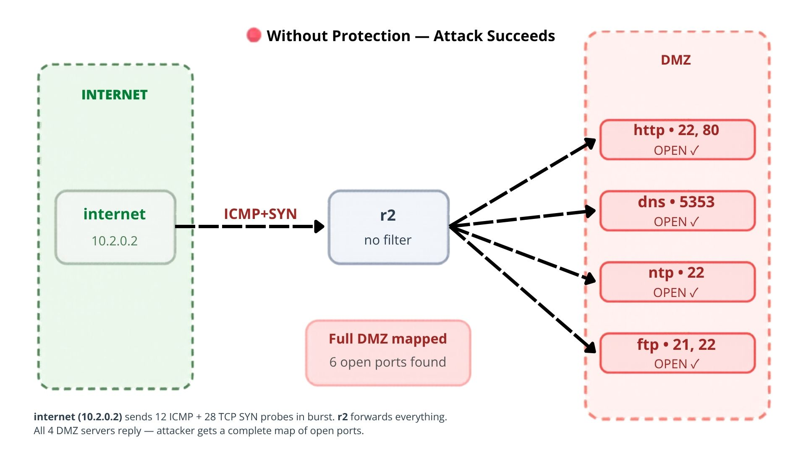
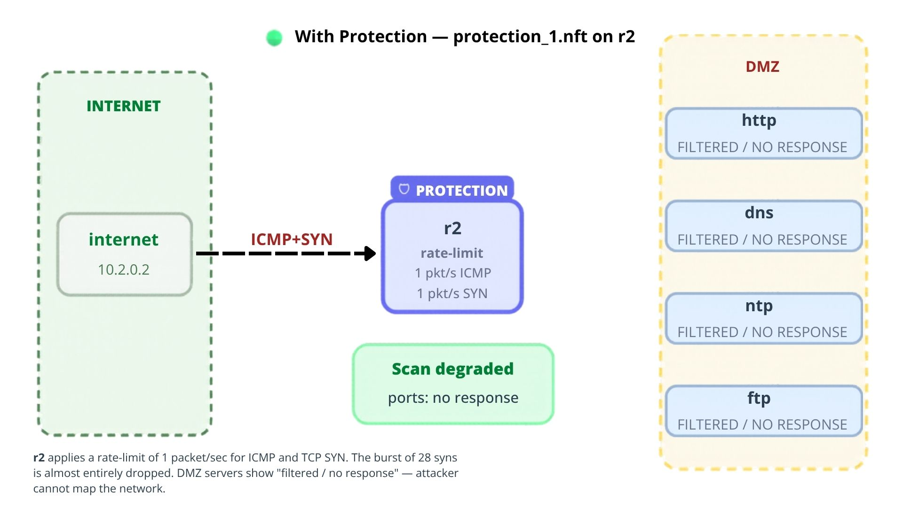
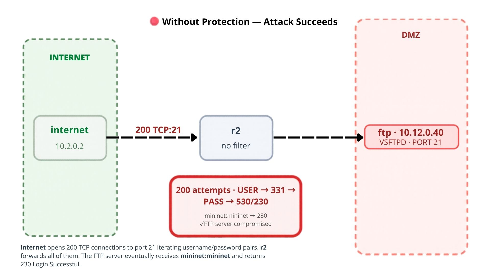
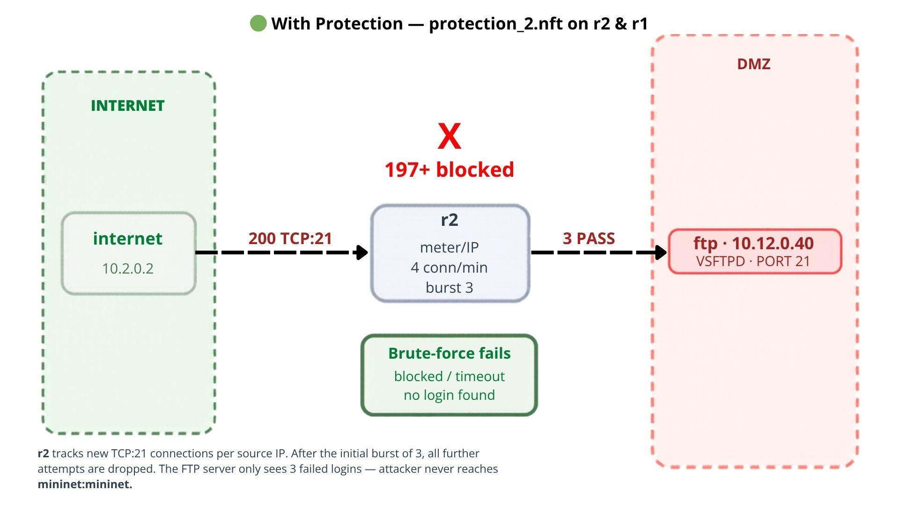
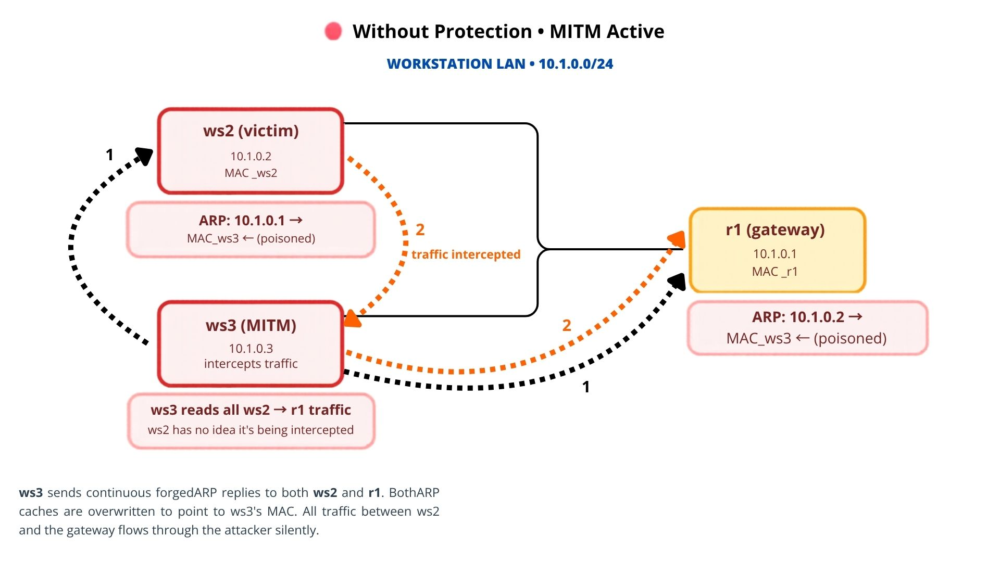
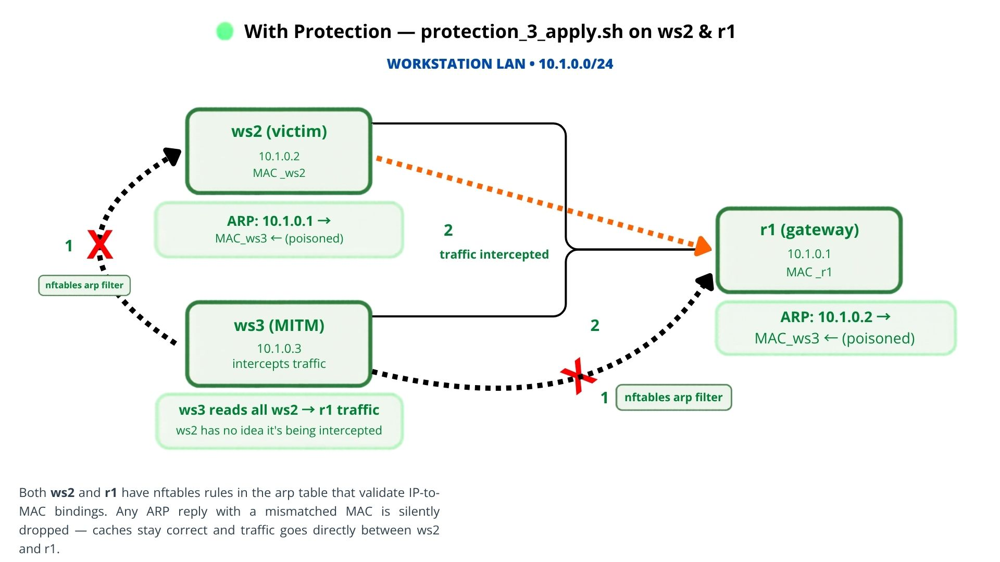
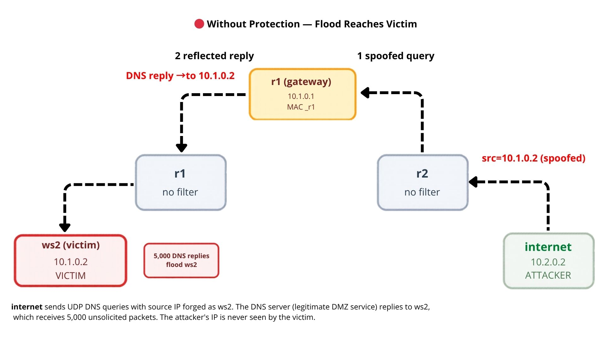
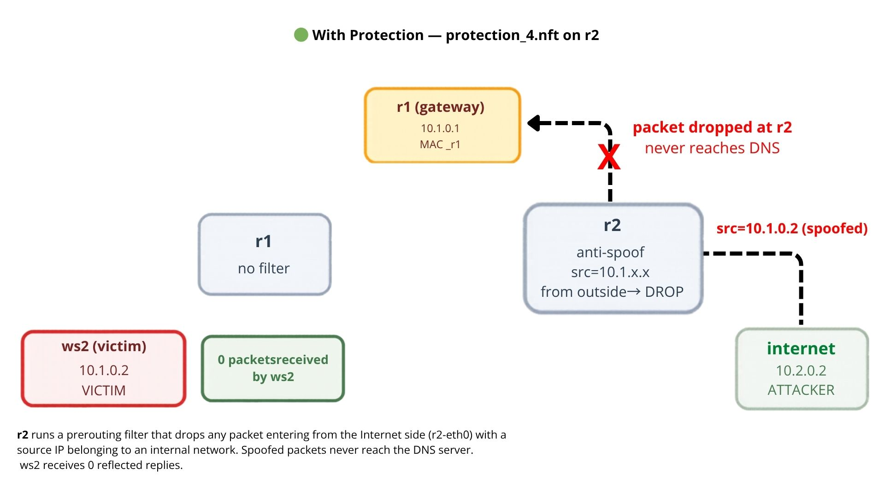

# LINFO2347 -- Project 2: Network Attacks

## Overview

This project implements a basic enterprise network protection using nftables firewall rules on a Mininet-simulated network, along with network attack scripts and their corresponding defenses.

---

## Network Topology

```
            10.1.0.0/24                10.12.0.0/24                10.2.0.0/24
   +-----------------------+   +----------------------------+   +-----------------+
   |  Workstation LAN      |   |           DMZ              |   |    Internet     |
   |                       |   |                            |   |                 |
   |  ws2  10.1.0.2        |   |  http  10.12.0.10          |   |  internet       |
   |  ws3  10.1.0.3        |   |  dns   10.12.0.20  :5353   |   |   10.2.0.2      |
   |                       |   |  ntp   10.12.0.30          |   |                 |
   |        (gw .1)        |   |  ftp   10.12.0.40          |   |     (gw .1)     |
   +-----------+-----------+   |  (gw r1=.1, r2=.2)         |   +--------+--------+
               |               +------+----------------+----+            |
               | s1                   | s2             |                 |
               |                      |                |                 |
          +----+---- r1 --------------+                +-------- r2 -----+
          r1-eth0 (10.1.0.1)                            r2-eth0 (10.2.0.1)
          r1-eth12 (10.12.0.1)                          r2-eth12 (10.12.0.2)
```

**Services running in the DMZ:**
- `http` -- Apache2 (port 80), sshd (port 22)
- `dns` -- dnsmasq (port 5353)
- `ntp` -- OpenNTPD (port 123), sshd (port 22)
- `ftp` -- vsftpd (port 21), sshd (port 22)

---

## Base Firewall (`firewall-rules.nft`)

### Three-zone policy

| Source zone | Can initiate connections to |
|---|---|
| Workstations (10.1.0.0/24) | DMZ + Internet + other workstations |
| DMZ (10.12.0.0/24) | Nothing -- reply traffic only |
| Internet (10.2.0.0/24) | DMZ only (never workstations) |

Return traffic for established/related connections is always allowed.

### How to run

```bash
sudo mn -c
cd ~/LINFO2347/project-network-attacks
sudo -E python3 topo.py
```

From the Mininet CLI:

```
r1 nft -f firewall-rules.nft
r2 nft -f firewall-rules.nft
```

### Baseline connectivity tests

```
ws2 ping -c 2 10.12.0.10         # WS -> DMZ       : 0% loss
ws2 ping -c 2 10.2.0.2           # WS -> Internet  : 0% loss
internet ping -c 2 10.12.0.10    # Internet -> DMZ : 0% loss
http ping -c 2 -W 2 10.1.0.2     # DMZ -> WS       : 100% loss (blocked)
http ping -c 2 -W 2 10.2.0.2     # DMZ -> Internet : 100% loss (blocked)
internet ping -c 2 -W 2 10.1.0.2 # Internet -> WS  : 100% loss (blocked)
```

---

## Attacks and Protections

---

### Attack 1 -- Network Scan

#### The attack (`attacks/attack_1.py`)

The script performs reconnaissance against the DMZ from the Internet host. It first sends a burst of ICMP Echo Requests to discover reachable DMZ hosts, then sends a burst of TCP SYN packets to identify which services are open.

The attack is implemented with Scapy only -- no external scanning tools. It probes the four DMZ servers (`http`, `dns`, `ntp`, `ftp`) and checks ports `21`, `22`, `53`, `80`, `123`, `443`, and `5353`. The script sends `12` ICMP probes (`3` per host) and `28` TCP SYN probes (`4` hosts x `7` ports) in short bursts. This models a fast reconnaissance phase and makes rate-limit based protection visible.

**Run the attack (no protection):**

```
r1 nft -f firewall-rules.nft
r2 nft -f firewall-rules.nft
internet python3 attacks/attack_1.py
```

Expected output without protection: the script discovers the full DMZ and identifies several exposed services.

```
[*] ICMP sweep
[*] Sending 12 ICMP probes in burst
[+] Host alive: 10.12.0.10
[+] Host alive: 10.12.0.20
[+] Host alive: 10.12.0.30
[+] Host alive: 10.12.0.40

[*] TCP SYN scan
[*] Sending 28 TCP SYN probes in burst
```

Observed open services without protection:

```
10.12.0.10: 22/tcp OPEN, 80/tcp OPEN
10.12.0.20: 5353/tcp OPEN
10.12.0.30: 22/tcp OPEN
10.12.0.40: 21/tcp OPEN, 22/tcp OPEN
```



#### The protection (`protection/protection_1.nft`)

The protection rate-limits scan-like traffic from the Internet towards the DMZ. ICMP sweep traffic is limited to `1/second` with a burst of `1` packet, and TCP SYN scan traffic is limited to `1/second` with a burst of `1` packet.

**How it does not break the base firewall:**

`protection_1.nft` is additive -- it adds a separate chain at hook priority `-10` and does not flush the base firewall. It only limits ICMP and new TCP SYN packets from `10.2.0.0/24` to `10.12.0.0/24`; other traffic continues to be handled by the base rules.

**Apply the protection on top of the base firewall:**

```
r1 nft -f firewall-rules.nft
r2 nft -f firewall-rules.nft
r2 nft -f protection/protection_1.nft
```

**Run the attack with protection active:**

```
internet python3 attacks/attack_1.py
```

Expected output with protection: the ICMP burst may still discover hosts because a few probes are allowed, but the TCP SYN burst is heavily degraded. Most ports become `filtered or no response`, so the attacker can no longer reliably enumerate exposed services.

Observed result with protection:

```
[*] ICMP sweep
[*] Sending 12 ICMP probes in burst
[+] Host alive: 10.12.0.10
[+] Host alive: 10.12.0.20
[+] Host alive: 10.12.0.30
[+] Host alive: 10.12.0.40

[*] TCP SYN scan
[*] Sending 28 TCP SYN probes in burst

[*] Target 10.12.0.10
  21/tcp closed
  22/tcp filtered or no response
  53/tcp filtered or no response
  80/tcp filtered or no response
  123/tcp filtered or no response
  443/tcp filtered or no response
  5353/tcp filtered or no response

[*] Target 10.12.0.20
  21/tcp filtered or no response
  22/tcp filtered or no response
  53/tcp filtered or no response
  80/tcp filtered or no response
  123/tcp filtered or no response
  443/tcp filtered or no response
  5353/tcp filtered or no response

[*] Target 10.12.0.30
  21/tcp filtered or no response
  22/tcp filtered or no response
  53/tcp filtered or no response
  80/tcp filtered or no response
  123/tcp filtered or no response
  443/tcp filtered or no response
  5353/tcp filtered or no response

[*] Target 10.12.0.40
  21/tcp filtered or no response
  22/tcp filtered or no response
  53/tcp filtered or no response
  80/tcp filtered or no response
  123/tcp filtered or no response
  443/tcp filtered or no response
  5353/tcp filtered or no response
```

This confirms that the protection does not block the Internet host completely and does not rely on the attacker's IP address specifically. It structurally reduces high-rate ICMP/SYN reconnaissance while keeping legitimate low-rate traffic possible.



**Verify baseline tests still pass:**

```
ws2 ping -c 2 10.12.0.10         # WS -> DMZ       : 0% loss
ws2 ping -c 2 10.2.0.2           # WS -> Internet  : 0% loss
internet ping -c 2 10.12.0.10    # Internet -> DMZ : 0% loss
http ping -c 2 -W 2 10.1.0.2     # DMZ -> WS       : 100% loss
http ping -c 2 -W 2 10.2.0.2     # DMZ -> Internet : 100% loss
internet ping -c 2 -W 2 10.1.0.2 # Internet -> WS  : 100% loss
```

---

### Attack 2 -- FTP Brute-Force

#### The attack (`attacks/attack_2.py`)

The script performs a brute-force attack against the FTP server (`ftp`, 10.12.0.40) by trying 200 username/password combinations (10 usernames x 20 passwords).

The FTP protocol is implemented from scratch using Python's `socket` standard library -- no external dependencies. The exchange follows the plaintext FTP authentication flow:

```
Client -> Server : USER <username>
Server -> Client : 331 Password required
Client -> Server : PASS <password>
Server -> Client : 230 Login successful   (or 530 Login incorrect)
```

The script distinguishes three outcomes per attempt:
- `SUCCESS` -- server returned 230 (valid credentials found)
- `rejected` -- server returned 530 (wrong credentials, connection worked)
- `blocked/timeout` -- connection timed out or was refused

Timing note: the script uses a `5` second socket timeout and a `0.2` second delay between attempts. This delay is intentionally added for the Mininet lab so `vsftpd` can answer consistently during the unprotected test. It should not be interpreted as a realistic Internet brute-force speed. Even with this lab-friendly delay, the attack still performs about 300 login attempts per minute, which is far above normal interactive FTP usage and enough to trigger the protection.

**Run the attack (no protection):**

```
r1 nft -f firewall-rules.nft
r2 nft -f firewall-rules.nft
internet python3 attacks/attack_2.py 10.12.0.40
```

Expected output: mostly `rejected`, and eventually 1 `SUCCESS` if the valid pair `mininet:mininet` is reached. Occasional `blocked/timeout` lines without protection can come from the FTP service timing out under repeated failed logins, not from nftables.



#### The protection (`protection/protection_2.nft`)

The protection limits new TCP connections to port 21 to **4 per minute per source IP** (with an initial burst of 3). A brute-force that opens hundreds of connections per minute is stopped after the first burst; a legitimate user opening 1-2 FTP sessions is unaffected.

**How it does not break the base firewall:**

`protection_2.nft` is additive -- it does not modify or flush the base firewall. It adds a new nftables chain (`ftp_brute_protection`) at hook priority -10, which is evaluated before the base `forward` chain (priority 0). The chain only handles new TCP connections to port 21; all other traffic falls through to the base firewall unchanged.

- `iifname "r2-eth0"` -- rate-limit applies only for Internet-side traffic on r2
- `iifname "r1-eth0"` -- rate-limit applies only for workstation-side traffic on r1

This means the six baseline ping tests are unaffected (ICMP, not TCP port 21).

**Apply the protection on top of the base firewall:**

```
r1 nft -f firewall-rules.nft
r2 nft -f firewall-rules.nft
r1 nft -f protection/protection_2.nft
r2 nft -f protection/protection_2.nft
```

**Run the attack with protection active:**

```
internet python3 attacks/attack_2.py 10.12.0.40
```

Expected output: the first few attempts may be `rejected`, then most attempts become `blocked/timeout` because nftables drops new FTP connections above the configured rate limit. With protection active, `blocked/timeout` should dominate much more clearly than in the unprotected run.

**Inspect the meter:**

```
r2 nft list meters
```



**Verify baseline tests still pass:**

```
ws2 ping -c 2 10.12.0.10         # WS -> DMZ       : 0% loss
ws2 ping -c 2 10.2.0.2           # WS -> Internet  : 0% loss
internet ping -c 2 10.12.0.10    # Internet -> DMZ : 0% loss
http ping -c 2 -W 2 10.1.0.2     # DMZ -> WS       : 100% loss
http ping -c 2 -W 2 10.2.0.2     # DMZ -> Internet : 100% loss
internet ping -c 2 -W 2 10.1.0.2 # Internet -> WS  : 100% loss
```

---

### Attack 3 -- ARP Cache Poisoning

#### The attack (`attacks/attack_3.py`)

The script performs ARP cache poisoning on the workstation LAN. It runs from `ws3` and forges ARP replies so that `ws2` believes the gateway (`r1`, `10.1.0.1`) is at `ws3`'s MAC address, while `r1` believes `ws2` (`10.1.0.2`) is at `ws3`'s MAC address.

The attack is implemented with Scapy only -- no external attack tools. The script resolves the real MAC addresses first and continuously sends forged ARP replies. It intentionally leaves the poisoned ARP entries in place after it stops so the result can be inspected.

The demonstrated attack uses:

- attacker: `ws3` (`10.1.0.3`)
- victim: `ws2` (`10.1.0.2`)
- gateway impersonated to the victim: `r1` (`10.1.0.1`)

**Run the attack (no protection):**

```
r1 nft -f firewall-rules.nft
r2 nft -f firewall-rules.nft
ws3 sysctl -w net.ipv4.ip_forward=1
ws2 ip link show ws2-eth0
r1 ip link show r1-eth0
ws3 ip link show ws3-eth0
ws2 ping -c 1 10.1.0.1
r1 ping -c 1 10.1.0.2
ws2 ip neigh show 10.1.0.1
r1 ip neigh show 10.1.0.2
ws3 python3 attacks/attack_3.py --victim 10.1.0.2 --gateway 10.1.0.1 --duration 30 --verbose
```

After the attack finishes, verify the poisoned ARP caches:

```
ws2 ip neigh show 10.1.0.1
r1 ip neigh show 10.1.0.2
```

Expected output: before the attack, `ws2` maps `10.1.0.1` to the real `r1` MAC and `r1` maps `10.1.0.2` to the real `ws2` MAC. After the attack, both entries should point to `ws3`'s MAC address. With IP forwarding enabled on `ws3`, `ws2` can keep connectivity while traffic is redirected through the attacker.



#### The protection (`protection/protection_3.nft`)

The protection filters forged ARP replies by validating expected IP-to-MAC bindings. A packet claiming that `10.1.0.1` is the gateway must use the real `r1` MAC address, and a packet claiming that `10.1.0.2` is `ws2` must use the real `ws2` MAC address.

**How it does not break the base firewall:**

`protection_3.nft` documents the ARP nftables protection, and `protection_3_apply.sh` generates the concrete nftables rule at runtime. This is necessary because Mininet MAC addresses are generated when the topology starts. The loaded rule uses the `arp` nftables family, separate from the `inet` table used by `firewall-rules.nft`, and only drops ARP replies with invalid IP/MAC bindings. Legitimate ARP traffic keeps working.

**Apply the protection:**

```
ws2 sh protection/protection_3_apply.sh 10.1.0.1
r1 sh protection/protection_3_apply.sh 10.1.0.2
```

Each host learns the legitimate MAC for the IP it must trust, then installs a rule that drops any ARP reply claiming that IP with a different MAC.

**Inspect the generated rules:**

```
ws2 nft list ruleset
r1 nft list ruleset
```

**Run the attack with protection active:**

```
ws2 ip neigh flush 10.1.0.1
r1 ip neigh flush 10.1.0.2
ws2 ping -c 1 10.1.0.1
r1 ping -c 1 10.1.0.2
ws2 ip neigh show 10.1.0.1
r1 ip neigh show 10.1.0.2
ws3 python3 attacks/attack_3.py --victim 10.1.0.2 --gateway 10.1.0.1 --duration 30 --verbose
ws2 ip neigh show 10.1.0.1
r1 ip neigh show 10.1.0.2
```

Expected output: the ARP tables stay mapped to the real MAC addresses instead of changing to `ws3`'s MAC. This verifies that the protection blocks the forged ARP replies without relying on a rate limit or on blocking the attacker IP.



**Verify baseline tests still pass:**

```
ws2 ping -c 2 10.12.0.10         # WS -> DMZ       : 0% loss
ws2 ping -c 2 10.2.0.2           # WS -> Internet  : 0% loss
internet ping -c 2 10.12.0.10    # Internet -> DMZ : 0% loss
http ping -c 2 -W 2 10.1.0.2     # DMZ -> WS       : 100% loss
http ping -c 2 -W 2 10.2.0.2     # DMZ -> Internet : 100% loss
internet ping -c 2 -W 2 10.1.0.2 # Internet -> WS  : 100% loss
```

---

### Attack 4 -- Reflected DNS Flood

#### The attack (`attacks/attack_4.py`)

The script performs a reflected DNS flood using IP spoofing. It runs from the Internet host and sends DNS requests to the DMZ DNS server (`dns`, `10.12.0.20:5353`) while forging the source IP as the victim workstation (`ws2`, `10.1.0.2`). The DNS server then sends its replies to the victim, reflecting traffic through a legitimate DMZ service.

The attack is implemented with Scapy only -- no external attack tools. Each packet is a UDP DNS query for `example.com` with:

- source IP: `10.1.0.2` (victim)
- destination IP: `10.12.0.20` (DNS reflector)
- destination port: `5353`

**Run the attack (no protection):**

```
r1 nft -f firewall-rules.nft
r2 nft -f firewall-rules.nft
ws2 tcpdump -i ws2-eth0 -n 'udp and host 10.12.0.20' > /tmp/ws2_reflected_before.txt 2>&1 &
internet python3 attacks/attack_4.py
ws2 pkill tcpdump
ws2 cat /tmp/ws2_reflected_before.txt
```

Expected output: `ws2` captures DNS replies from `10.12.0.20`, even though `ws2` did not send the DNS queries itself.

Observed result without protection:

```
06:46:34.278199 IP 10.12.0.20.5353 > 10.1.0.2.34051: 0* 1/0/0 A 192.0.2.192 (45)
06:46:34.281001 IP 10.12.0.20.5353 > 10.1.0.2.65443: 0* 1/0/0 A 192.0.2.192 (45)
06:46:34.289171 IP 10.12.0.20.5353 > 10.1.0.2.39444: 0* 1/0/0 A 192.0.2.192 (45)
...
5000 packets captured
5000 packets received by filter
0 packets dropped by kernel
```



#### The protection (`protection/protection_4.nft`)

The protection implements ingress anti-spoofing on `r2`. Packets entering from the Internet-facing interface (`r2-eth0`) are dropped if they claim to come from internal enterprise ranges (`10.1.0.0/24` or `10.12.0.0/24`).

**How it does not break the base firewall:**

`protection_4.nft` is additive -- it creates a separate `inet` table with a `prerouting` chain and does not flush the base firewall. Legitimate Internet traffic has source `10.2.0.0/24`, so normal Internet-to-DMZ access is unaffected.

**Apply the protection on top of the base firewall:**

```
r1 nft -f firewall-rules.nft
r2 nft -f firewall-rules.nft
r2 nft -f protection/protection_4.nft
```

**Run the attack with protection active:**

```
ws2 tcpdump -i ws2-eth0 -n 'udp and host 10.12.0.20' > /tmp/ws2_reflected_after.txt 2>&1 &
internet python3 attacks/attack_4.py
ws2 pkill tcpdump
ws2 cat /tmp/ws2_reflected_after.txt
```

Expected output: `ws2` should not receive reflected DNS replies because the spoofed packets are dropped before reaching the DNS server.

Observed result with protection:

```
tcpdump: verbose output suppressed, use -v or -vv for full protocol decode
listening on ws2-eth0, link-type EN10MB (Ethernet), capture size 262144 bytes

0 packets captured
0 packets received by filter
0 packets dropped by kernel
```

The demonstration therefore goes from `5000` reflected packets without protection to `0` packets with protection.

**Inspect the protection counter:**

```
r2 nft list ruleset
```

The drop counter in `protection_4.nft` should increase while the attack runs.



**Verify baseline tests still pass:**

```
ws2 ping -c 2 10.12.0.10         # WS -> DMZ       : 0% loss
ws2 ping -c 2 10.2.0.2           # WS -> Internet  : 0% loss
internet ping -c 2 10.12.0.10    # Internet -> DMZ : 0% loss
http ping -c 2 -W 2 10.1.0.2     # DMZ -> WS       : 100% loss
http ping -c 2 -W 2 10.2.0.2     # DMZ -> Internet : 100% loss
internet ping -c 2 -W 2 10.1.0.2 # Internet -> WS  : 100% loss
```

---

## File Structure

```
project-network-attacks/
|-- topo.py                  # Mininet topology (provided by the course)
|-- firewall-rules.nft       # Base three-zone enterprise firewall
|-- attacks/
|   |-- attack_1.py          # Network scan (Scapy)
|   |-- attack_2.py          # FTP brute-force (Python stdlib, no dependencies)
|   |-- attack_3.py          # ARP cache poisoning MITM (Scapy)
|   `-- attack_4.py          # Reflected DNS flood (Scapy)
|-- protection/
|   |-- protection_1.nft     # ICMP/SYN scan rate-limiting
|   |-- protection_2.nft     # FTP rate-limiting (additive nftables chain)
|   |-- protection_3.nft     # ARP anti-spoofing with IP/MAC validation
|   |-- protection_3_apply.sh# Runtime script to generate ARP binding rules
|   `-- protection_4.nft     # Anti-spoofing for reflected DNS flood
|-- images/
|   |-- 1.jpg                # Attack 1 -- without protection
|   |-- 2.jpg                # Attack 1 -- with protection
|   |-- 3.jpg                # Attack 2 -- without protection
|   |-- 4.jpg                # Attack 2 -- with protection
|   |-- 5.jpg                # Attack 3 -- without protection
|   |-- 6.jpg                # Attack 3 -- with protection
|   |-- 7.jpg                # Attack 4 -- without protection
|   `-- 8.jpg                # Attack 4 -- with protection
`-- README.md
```
